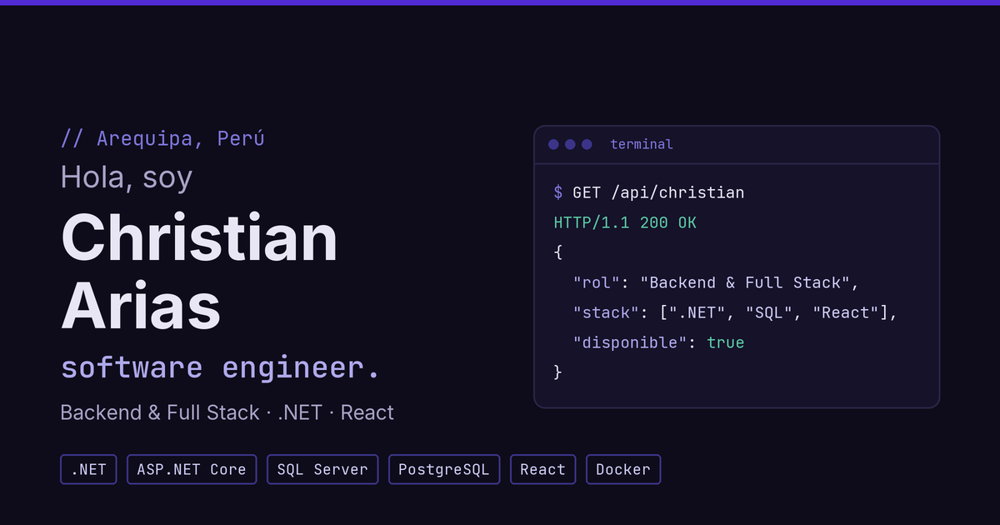

# Christian Arias · Portafolio

Portafolio personal de **Christian Arias**, Software Engineer en Arequipa, Perú. Desarrollador backend y full stack con .NET, ASP.NET Core, SQL Server, PostgreSQL y React.

**Sitio:** https://react-portfolio-gamma-three.vercel.app



## Secciones

- **Inicio:** presentación con una terminal interactiva que consulta en vivo `GET /api/christian` y acepta comandos (ver abajo).
- **Sobre mí:** experiencia y enfoque, con un cubo 3D de las tecnologías principales.
- **Proyectos:** sistema de gestión para restaurantes, HNCASE (central de esterilización) y sistema de reservas Santa Ursula.
- **Contacto:** formulario con envío por EmailJS y enlaces a correo, LinkedIn, GitHub y WhatsApp.
- **CV:** visor del currículum en PDF con descarga en español e inglés.

## Terminal interactiva

Al terminar la animación inicial, la terminal de la portada acepta comandos:

| Comando | Qué hace |
|---|---|
| `help` | Lista los comandos |
| `whoami` | Nombre, título y rol |
| `stack` | Stack completo por categoría |
| `experiencia` | Empresas, cargos y fechas |
| `proyectos` | Proyectos y su stack |
| `contacto` | Correo, LinkedIn y GitHub |
| `ir <sección>` | Navega a `sobre-mi`, `proyectos` o `contacto` |
| `cv` | Abre la página del CV |
| `curl` | Consulta `GET /api/christian` y muestra el JSON completo |
| `clear` | Limpia la terminal |

Soporta historial con ↑ / ↓ y autocompletado con Tab. En celular hay botones de comandos rápidos.

## API

El perfil también está disponible como JSON en un endpoint público (función serverless de Vercel):

```bash
curl https://react-portfolio-gamma-three.vercel.app/api/christian
```

| | |
|---|---|
| Método | `GET` (otros métodos responden `405`) |
| Formato | `application/json` con sangría |
| CORS | Abierto (`Access-Control-Allow-Origin: *`) |
| Caché | 1 hora en la CDN de Vercel |

Campos: `nombre`, `titulo`, `rol`, `ubicacion`, `disponible`, `stackPrincipal`, `stack`, `experiencia`, `proyectos`, `contacto`, `cv` y `sitio`.

Los datos salen de `src/data/profile.js`, la misma fuente que usan las secciones del sitio. En desarrollo, el endpoint responde en `http://localhost:3000/api/christian`.

## Stack

| | |
|---|---|
| Framework | React 19 + React Router 7 |
| Build | Vite 8 |
| Estilos | Sass (SCSS) con variables de diseño |
| Tipografías | Inter y JetBrains Mono (`@fontsource`) |
| Íconos | Font Awesome 7 y Devicon |
| PDF | react-pdf 11 |
| Formulario | EmailJS |
| Hosting | Vercel |

## Cómo correrlo

Requiere **Node.js 22.13 o superior**.

```bash
npm install
npm run dev
```

El sitio queda en http://localhost:3000.

| Script | Qué hace |
|---|---|
| `npm run dev` | Servidor de desarrollo |
| `npm run build` | Build de producción en `dist/` |
| `npm run preview` | Sirve el build de producción localmente |

## Estructura

```
src/
├── assets/          CV en PDF (ES y EN)
├── components/
│   ├── Navbar/      Barra superior con navegación por secciones
│   ├── Main/        Página única que compone las secciones
│   ├── Home/        Portada y terminal animada
│   ├── About/       Sobre mí y cubo de tecnologías
│   ├── Projects/    Tarjetas de proyectos
│   ├── Contact/     Formulario y enlaces de contacto
│   └── Resume/      Visor del CV
├── data/            Datos del perfil (fuente única para el sitio y la API)
└── styles/          Variables de diseño y estilos globales
api/
└── christian.js     Endpoint GET /api/christian
```

## Contacto

- Correo: chris.29.01.44@gmail.com
- LinkedIn: [christian-alfredo-arias-bejar](https://www.linkedin.com/in/christian-alfredo-arias-bejar-7a835a21b/)
- GitHub: [chris44m](https://github.com/chris44m)
